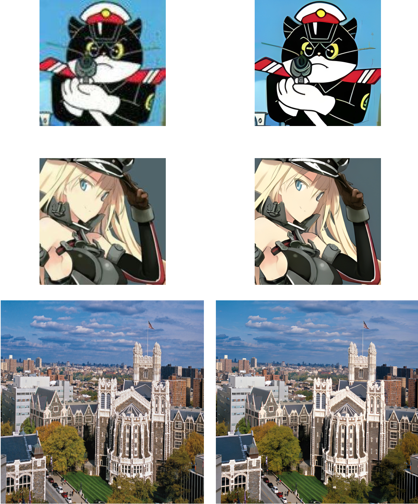

<a name="readme-top"></a>

[![Contributors][contributors-shield]][contributors-url]
[![Forks][forks-shield]][forks-url]
[![Stargazers][stars-shield]][stars-url]
[![Issues][issues-shield]][issues-url]
[![MIT License][license-shield]][license-url]
[![LinkedIn][linkedin-shield]][linkedin-url]
[![GitHub][github-shield]][github-url]

# [Real-ESRGAN] | Implementation of Real-ESRGAN

<br />
<div align="center">
    


<h3 align="center">Implementation of Real-ESRGAN</h3>

  <p align="center">
    Implementation of the paper <br />
     <a href="https://arxiv.org/abs/2107.10833"><strong>Real-ESRGAN: Training Real-World Blind Super-Resolution with Pure Synthetic Data</strong></a>
    <br />
    <br />
    <a href="https://github.com/GeorgiosIoannouCoder/realesrgan"><strong>Explore the docs »</strong></a>
    <br />
    <br />
    <a href="https://github.com/GeorgiosIoannouCoder/realesrgan/issues">Report Bug</a>
    <a href="https://github.com/GeorgiosIoannouCoder/realesrgan/issues">Request Feature</a>
  </p>
</div>

<details>
  <summary>Table of Contents</summary>
  <ol>
    <li>
      <a href="#about-the-project">About The Project</a>
      <ul>
         <li><a href="#problem-statement">Problem Statement</a></li>
        <li><a href="#key-features">Key Features</a></li>
        <li><a href="#built-with">Built With</a></li>
      </ul>
    </li>
    <li>
      <a href="#getting-started">Getting Started</a>
      <ul>
        <li><a href="#prerequisites">Prerequisites</a></li>
        <li><a href="#setup">Setup</a></li>
      </ul>
    </li>
    <li><a href="#usage">Usage</a></li>
    <li><a href="#demo">Demo</a></li>
    <li><a href="#reports">Reports</a></li>
    <li><a href="#contributing">Contributing</a></li>
    <li><a href="#license">License</a></li>
    <li><a href="#contact">Contact</a></li>
  </ol>
</details>

## About The Project


- **This propject is the implementation of the Real-ESRGAN and the Real-ESRNet from the paper "Real-ESRGAN: Training Real-World Blind Super-Resolution
with Pure Synthetic Data"**
- **Depth-First Search (DFS) and Breadth-First Search (BFS) are two techniques of traversing graphs and trees. DFS explores a graph or tree by diving as deeply as possible along a branch before backtracking, making it well-suited for tasks like finding paths and topological sorting. It is implemented using the stack data structure and recursion. Arrays/Lists can be used to implement the stack data structure.**
- **BFS systematically explores all neighbors of a node before moving to their neighbors, making it ideal for finding the shortest path in unweighted graphs and efficiently visiting nodes level by level. BFS employs a queue to maintain a first-in-first-out order, allowing them to serve different graph exploration needs.**

### Problem Statement

**Trying to improve the quality of blurry images without knowing how they got blurry in the first place. However, existing methods still struggle with fixing common issues in real-world pictures. In this project, a strong image enhancement tool called ESRGAN is adapted for practical use and it is now called Real-ESRGAN. Real-ESRGAN has been trained using computer-generated data to better imitate complex real-world image problems. Real-ESRGAN also accounts for some common visual problems that might occur during the enhancement process. Real-ESRGAN does a better job than other methods when fixing real images.**

### Key Features

1. **Practical Application of ESRGAN: The researchers extended the use of ESRGAN (Enhanced Super-Resolution Generative Adversarial Network) for practical image restoration applications.**
2. **Training with Synthetic Data: Real-ESRGAN is trained using exclusively synthetic data. This means the model learns from computer-generated examples rather than real-world images.**
3. **High-Order Degradation Modeling: The authors introduced a high-order degradation modeling process. This helps the model better simulate and understand complex real-world image degradations.**
4. **Consideration of Common Artifacts: Real-ESRGAN takes into account common visual artifacts like ringing and overshoot that can occur during the image synthesis process.**
5. **Improved Discriminator Capability: A U-Net discriminator with spectral normalization is employed to enhance the discriminator's ability to evaluate and improve the training process's stability.**
6. **Superior Visual Performance: Extensive comparisons with previous methods on various real datasets demonstrate that Real-ESRGAN outperforms them in terms of visual quality.**

<p align="right"><a href="#readme-top">Back to top</a></p>

### Built With

[![Python][Python]][Python-url]
[![BasicSR][BasicSR]][BasicSR-url]
[![Numpy][Numpy]][Numpy-url]
[![OpenCV][OpenCV]][OpenCV-url]
[![Pillow][Pillow]][Pillow-url]
[![Streamlit][Streamlit]][Streamlit-url]
[![Pytorch][Pytorch]][Pytorch-url]
[![NERSC][NERSC]][NERSC-url]


<p align="right"><a href="#readme-top">Back to top</a></p>

## Getting Started

**To get a local copy of the Real-ESRGAN up and running locally follow these simple example steps:**

### Prerequisites

**NOTE:** How to check if Python is installed and what is its version

```sh
  python --version
```

**NOTE:** How to check if Git is installed and what is its version

```sh
  git -v
```

1. Please make sure you have pyenv installed and use Python3 version 3.10.9:

   - You can use pyenv to switch between different Python versions:
     - Windows: [https://www.youtube.com/watch?v=HTx18uyyHw8](https://github.com/pyenv-win/pyenv-win)
     - Mac: [https://www.youtube.com/watch?v=31WU0Dhw4sk](https://github.com/pyenv/pyenv)
     - Linux: [https://www.youtube.com/watch?v=1Zgo8M9yUtM](https://github.com/pyenv/pyenv)

2. Please make sure you have git installed

   - Windows: [https://git-scm.com/download/win](https://git-scm.com/download/win)
   - Mac: [https://git-scm.com/download/mac](https://git-scm.com/download/mac)
   - Linux: [https://git-scm.com/download/linux](https://git-scm.com/download/linux)
  
3. Please look at the [setup](https://github.com/GeorgiosIoannouCoder/realesrgan/tree/main/setup) folder found in this project.

### Setup

1. Navigate to the directory where you want to clone/run/save the application

   ```sh
   cd your_selected_directory
   ```

2. Clone this repository

   ```sh
   git clone https://github.com/GeorgiosIoannouCoder/realesrgan.git
   ```

3. Navigate to the realesrgan git repository

   ```sh
   cd realesrgan
   ```

4. Use Python3 3.10.9 version in the cloned repository folder

   ```sh
   pyenv local 3.10.9
   ```

5. Create virtual environment in the cloned repository folder

   ```sh
   python -m venv .realesrgan-venv
   ```

6. Activate the virtual environment (Windows OR Mac/Linux)
   1. Windows

   ```sh
   .\.realesrgan-venv\Scripts\activate
   ```

   2. Mac/Linux

   ```sh
   source .realesrgan/bin/activate
   ```
    
7. Run Streamlit

   ```sh
   streamlit run app.py
   ```

***NOTE: You can also use the inference/inference.py script to test the model in the command line. More instructions can be found below.***
<p align="right"><a href="#readme-top">Back to top</a></p>

## Usage

1. To get any of the model weights please contact me at any time. Please see the readme file of the directory [models](https://github.com/GeorgiosIoannouCoder/realesrgan/tree/main/models) and [model_needed_for_esrnet_training](https://github.com/GeorgiosIoannouCoder/realesrgan/tree/main/model_needed_for_esrnet_training) in this project for the required file structure and models.

***NOTE: For training, [NERSC](https://www.nersc.gov/) was used with four A100 GPUs due to the huge size of the datasets and network architectures. It took five days to train both the  Real-ESRNet and Real-ESRGAN.***

2. To train your own model please follow the following instructions:
   1. Download the datasets DF2K and OST Training from [here](https://cvnote.ddlee.cc/2019/09/22/image-super-resolution-datasets
). Please see the readme file of the directory datasets in this project for the required file structure.
   1. For the DF2K dataset, use a multi-scale strategy to downsample HR images to obtain several Ground-Truth images with different scales. Use the script [multiscale_df2k.py](https://github.com/GeorgiosIoannouCoder/realesrgan/blob/main/image_scaling/multiscale_df2k.py) to do this.
        ```sh
        python image_scaling/multiscale_df2k.py --input datasets/DF2K/DF2K_HR --output datasets/DF2K/DF2K_HR_multiscale
        ```
   2. Next, crop the DF2K images obtained from step 2 into sub-images. Use the script [image_crop.py](https://github.com/GeorgiosIoannouCoder/realesrgan/blob/main/image_cropping/image_crop.py) to do this.
        ```sh
        python image_cropping/image_crop.py --input datasets/DF2K/DF2K_HR_multiscale --output datasets/DF2K/DF2K_HR_multiscale_subimages
        ```
   3. Prepare a txt file containing the image paths. Use the script [image_path.py](https://github.com/GeorgiosIoannouCoder/realesrgan/blob/main/image_path_generator/image_path.py) to do this.
        ```sh
        python image_path_generator/image_path.py -input datasets/DF2K/DF2K_HR_multiscale_subimages datasets/OST/ANIMAL datasets/OST/BUILDING -root "" "" "" -path ./image_path_generator/gt_image_paths.txt
        ```
   4. Train Real-ESRNet using the script [training.py](https://github.com/GeorgiosIoannouCoder/realesrgan/blob/main/training/training.py).
        ```sh
        python training/training.py -opt training_parameters/real_esrnet_x4.yml
        ```
   5. Train Real-ESRGAN using the script [training.py](https://github.com/GeorgiosIoannouCoder/realesrgan/blob/main/training/training.py) and the model obtained from step 5.
        ```sh
        python training/training.py -opt training_parameters/real_esrgan_x4.yml --auto_resume
        ```
1. The training hasppens in two stages:
   1. First, train Real-ESRNet with L1 loss from the pre-trained model ESRGAN.
   2. Next, use the trained Real-ESRNet model as an initialization of the generator, and train the Real-ESRGAN with a combination of L1 loss, perceptual loss and GAN loss.
2. To inference any of the models use the script [inference.py](https://github.com/GeorgiosIoannouCoder/realesrgan/blob/main/inference/inference.py):
    ```sh
    python inference/inference.py -input "ccny.jpg" -model_name "REALSRGAN_x4" -output "inferences" -upscale 4 -model_path "./models/REALESRGAN_x4.pth" -extension "auto"
     ```
<p align="right"><a href="#readme-top">Back to top</a></p>

## Demo

1. **Training Porcess**

   https://www.loom.com/share/1378b1c1c6b64705902fa86d9ffac6d0?sid=0ce792a8-00f4-4068-a2a2-e407bcc5e98a

2. **Command Line Inference**

   https://www.loom.com/share/0a1fbd788dad4bc181db2c35d3385483?sid=a42066b5-d667-4262-b2a0-3aa03834018e

3. **Streamlit Web Applicatin Inference**
   
   https://www.loom.com/share/bee6b7ac7b87440895d8d3dc8da99e92?sid=079e215b-2daa-471b-8543-dfe186d982d6

<p align="right"><a href="#readme-top">Back to top</a></p>

## Reports

1. You can find the report for this project [here](https://github.com/GeorgiosIoannouCoder/realesrgan/blob/main/Ioannou_Georgios_Report.pdf) where it explains this project in detail.

<p align="right"><a href="#readme-top">Back to top</a></p>

## Contributing

Contributions are what make the open source community such an amazing place to learn, inspire, and create. Any contributions you make are **greatly appreciated**.

If you have a suggestion that would make this better, please fork the repo and create a pull request. You can also simply open an issue with the tag "enhancement".
Don't forget to give the project a star! Thanks again!

1. Fork the Project
2. Create your Feature Branch (`git checkout -b feature/AmazingFeature`)
3. Commit your Changes (`git commit -m 'Add some AmazingFeature'`)
4. Push to the Branch (`git push origin feature/AmazingFeature`)
5. Open a Pull Request

<p align="right"><a href="#readme-top">Back to top</a></p>

## License

Distributed under the MIT License. See [LICENSE](https://github.com/GeorgiosIoannouCoder/realesrgan/blob/main/LICENSE) for more information.

MIT License

Copyright (c) 2023 Georgios Ioannou

Permission is hereby granted, free of charge, to any person obtaining a copy
of this software and associated documentation files (the "Software"), to deal
in the Software without restriction, including without limitation the rights
to use, copy, modify, merge, publish, distribute, sublicense, and/or sell
copies of the Software, and to permit persons to whom the Software is
furnished to do so, subject to the following conditions:

The above copyright notice and this permission notice shall be included in all
copies or substantial portions of the Software.

THE SOFTWARE IS PROVIDED "AS IS", WITHOUT WARRANTY OF ANY KIND, EXPRESS OR
IMPLIED, INCLUDING BUT NOT LIMITED TO THE WARRANTIES OF MERCHANTABILITY,
FITNESS FOR A PARTICULAR PURPOSE AND NONINFRINGEMENT. IN NO EVENT SHALL THE
AUTHORS OR COPYRIGHT HOLDERS BE LIABLE FOR ANY CLAIM, DAMAGES OR OTHER
LIABILITY, WHETHER IN AN ACTION OF CONTRACT, TORT OR OTHERWISE, ARISING FROM,
OUT OF OR IN CONNECTION WITH THE SOFTWARE OR THE USE OR OTHER DEALINGS IN THE
SOFTWARE.

<p align="right"><a href="#readme-top">Back to top</a></p>

## Contact

Georgios Ioannou - [@LinkedIn](https://linkedin.com/in/georgiosioannoucoder)

Georgios Ioannou - [@georgiosioannoucoder](https://georgiosioannoucoder.github.io/) - Please contact me via the form in my portfolio.

Project Link: [https://github.com/GeorgiosIoannouCoder/realesrgan](https://github.com/GeorgiosIoannouCoder/realesrgan)

<p align="right"><a href="#readme-top">Back to top</a></p>

[contributors-shield]: https://img.shields.io/github/contributors/GeorgiosIoannouCoder/realesrgan.svg?style=for-the-badge
[contributors-url]: https://github.com/GeorgiosIoannouCoder/realesrgan/graphs/contributors
[forks-shield]: https://img.shields.io/github/forks/GeorgiosIoannouCoder/realesrgan.svg?style=for-the-badge
[forks-url]: https://github.com/GeorgiosIoannouCoder/realesrgan/network/members
[stars-shield]: https://img.shields.io/github/stars/GeorgiosIoannouCoder/realesrgan.svg?style=for-the-badge
[stars-url]: https://github.com/GeorgiosIoannouCoder/realesrgan/stargazers
[issues-shield]: https://img.shields.io/github/issues/GeorgiosIoannouCoder/realesrgan.svg?style=for-the-badge
[issues-url]: https://github.com/GeorgiosIoannouCoder/realesrgan/issues
[license-shield]: https://img.shields.io/github/license/GeorgiosIoannouCoder/realesrgan.svg?style=for-the-badge
[license-url]: https://github.com/GeorgiosIoannouCoder/realesrgan/blob/main/LICENSE
[linkedin-shield]: https://img.shields.io/badge/-LinkedIn-black.svg?style=for-the-badge&logo=linkedin&colorB=0077B5
[linkedin-url]: https://linkedin.com/in/georgiosioannoucoder
[github-shield]: https://img.shields.io/badge/-GitHub-black.svg?style=for-the-badge&logo=github&colorB=000
[github-url]: https://github.com/GeorgiosIoannouCoder/
[Python]: https://img.shields.io/badge/python-FFDE57?style=for-the-badge&logo=python&logoColor=4584B6
[Python-url]: https://www.python.org/
[BasicSR]: https://img.shields.io/badge/basicsr-000000?style=for-the-badge&logo=basicsr
[BasicSR-url]: https://basicsr.readthedocs.io/en/latest/
[Numpy]: https://img.shields.io/badge/numpy-%23013243.svg?style=for-the-badge&logo=numpy&logoColor=white
[Numpy-url]: https://numpy.org/
[OpenCV]: https://img.shields.io/badge/opencv-000000?style=for-the-badge&logo=opencv&logoColor=00ff00
[OpenCV-url]: https://opencv.org/
[Pillow]: https://img.shields.io/badge/pillow-000000?style=for-the-badge&logo=pillow
[Pillow-url]: https://pillow.readthedocs.io/en/stable/
[Streamlit]: https://img.shields.io/badge/streamlit-ffffff?style=for-the-badge&logo=streamlit&logoColor=ff0000
[Streamlit-url]: https://streamlit.io/
[Pytorch]: https://img.shields.io/badge/pytorch-%23EE4C2C.svg?style=for-the-badge&logo=pytorch&logoColor=white
[Pytorch-url]: https://pytorch.org/
[NERSC]: https://img.shields.io/badge/nersc-000000?style=for-the-badge&logo=nersc
[NERSC-url]: https://www.nersc.gov/